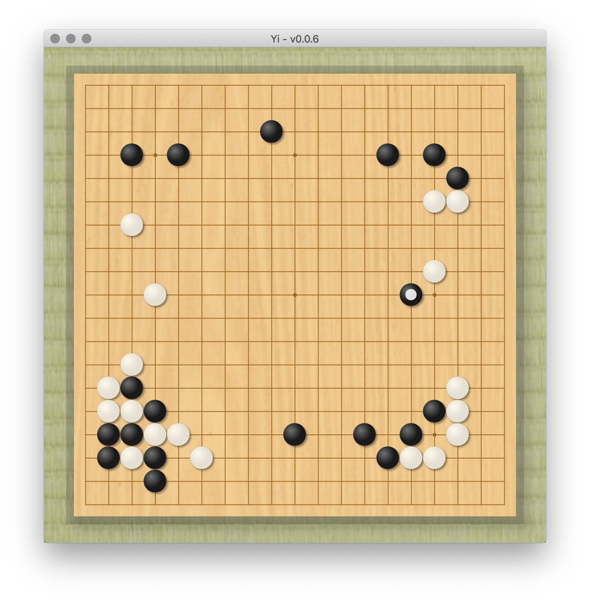

# 弈 (Yi), lit. Go
Formerly known as 'WeiqiTool' and 'QiPan', Yi strives to become an elegant and powerful companion for the dedicated players of the board game Go. It will feature a game record editor, AI analysis module, and a personal SGF library.

## Current Progress
Yi is a long way from v1.0.
As with all great apps, though, there are humble beginnings.
See [Projects](https://github.com/Nibby/QiPan/projects) for current development progress.

##Roadmap
To meet major release milestones, the following features are planned.

### Chapter 1: Humble Beginnings (v0.5 earlybird)
- [X] Rendering a goban
- [x] Basic stone placement
- [ ] Move tree
- [ ] Annotations
- [ ] SGF info editor
- [ ] Saving / loading SGF
- [ ] Support for **9x9**, **13x13**, **19x19** sizes
- [ ] Custom size board support
- [x] Multi-lingual support

### Chapter 2: Expanding Horizons (v0.7 alpha)
- [ ] Score estimation
- [ ] Scoring
- [ ] Support for multiple game rules
- [ ] SGF operations: rotate board, tutor mode etc.
- [ ] Printing support, export board as image etc.

### Chapter 3: Eye Candy and Zen (v0.9 beta)
- [x] Customizable stone, board and background styles
- [x] Customizable program color schemes?
- [ ] Animations, UI effects
- [ ] Sound effects

### Chapter 4: The Journey Begins (v1.0 +)
- [ ] Leela Zero review compatibility
- [ ] GTP support for AI engines (to play with)
- [ ] OGS client
- [ ] IGS client

... More to be announced!

## Dependencies
- Gradle
- JavaFX
- JSON