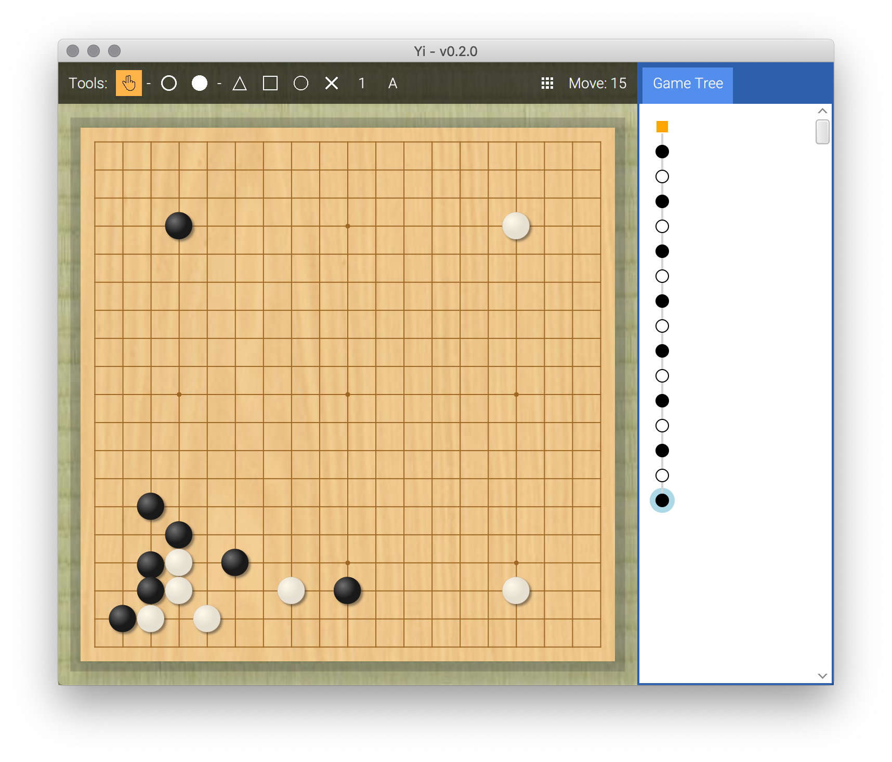

# Yi
Formerly known as 'WeiqiTool' and 'QiPan', Yi strives to become an elegant and powerful companion for the dedicated players of the board game Go. It will feature a game record editor, AI analysis module, and a personal SGF library.

## Current Progress
Yi is a long way from v1.0.
As with all great apps, though, there are humble beginnings.
See [Projects](https://github.com/Nibby/QiPan/projects) for current development progress.

### Chapter 1: Humble Beginnings (v0.5 earlybird)
- [X] Rendering a goban
- [x] Basic stone placement
- [x] Move tree
- [x] Annotations
- [ ] Saving / loading SGF
- [x] Support for **9x9**, **13x13**, **19x19** sizes
- [x] Custom size board support
- [x] Multi-lingual support

### Chapter 2: Expanding Horizons (v0.7 alpha)
- [ ] Score estimation
- [ ] Scoring
- [x] Support for multiple game rules
- [ ] SGF operations: rotate board, tutor mode etc.
- [ ] Supporting other record formats.

### Chapter 3: Eye Candy and Zen (v0.9 beta)
- [x] Customizable stone, board and background styles
- [x] Customizable program color schemes?
- [ ] Animations, UI effects
- [ ] Sound effects

### Chapter 4: The Journey Begins (v1.0 +)
- [ ] Printing support, export board as image etc.
- [ ] Leela Zero review compatibility
- [ ] GTP support for AI engines (to play with)
- [ ] OGS client
- [ ] IGS client

... More to be announced!

## Project setup
Prerequisites for the project are:
- OpenJDK 12+
- Gradle 5.6+

First, clone the repository from GitHub: 

`git clone https://github.com/Nibby/Yi.git Yi`

Yi is built using Gradle, you can import the project in your IDE as a Gradle project. To run the project in command line, use: `gradle run`.

- For IntelliJ IDEA users, use `File -> New -> Project from Existing Sources`, import and select `Gradle Project`.
- For Eclipse users, use `File -> Import -> Gradle -> Existing Gradle Project`
