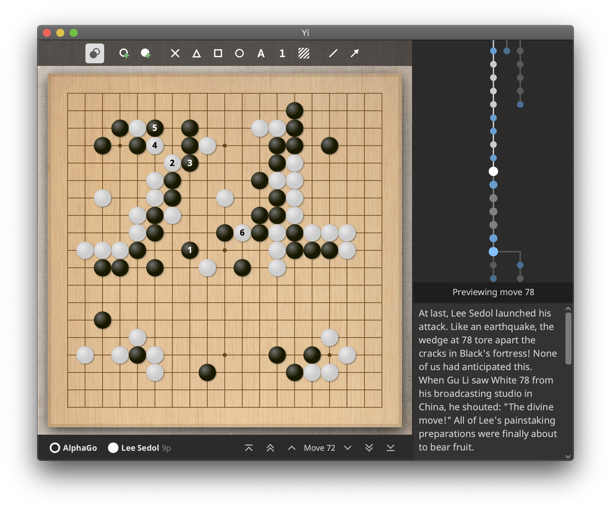

# Yi

Formerly known as 'WeiqiTool' and 'QiPan', Yi strives to become a powerful companion for the dedicated players of Go. It will feature a game record editor, AI analysis module, Go server client, and much more!

